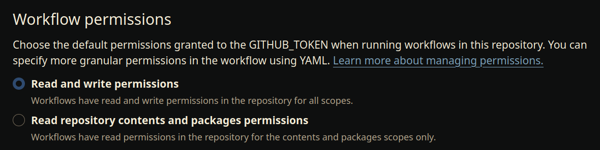
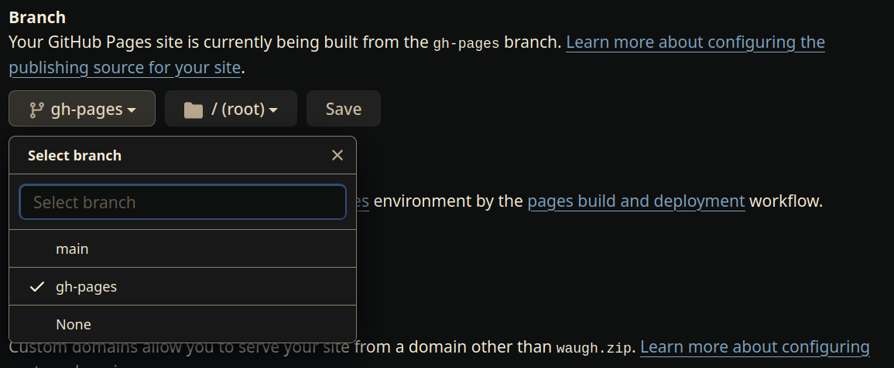

# tut-template

&nbsp;

## Setup
Go to settings

### Allow the github action to push new changes
* settings > actions > general
* ensure the workflow permissions are set to "Read and write permission"

&nbsp;

### Allow github pages to serve the repo
* create a new branch called "gh-pages"
* settings > pages
* set the branch to "gh-pages"

&nbsp;
&nbsp;

## Customisation

### Files to edit
* slides/config.toml
* slides/static/_config.yml
* slides/static/index.md
